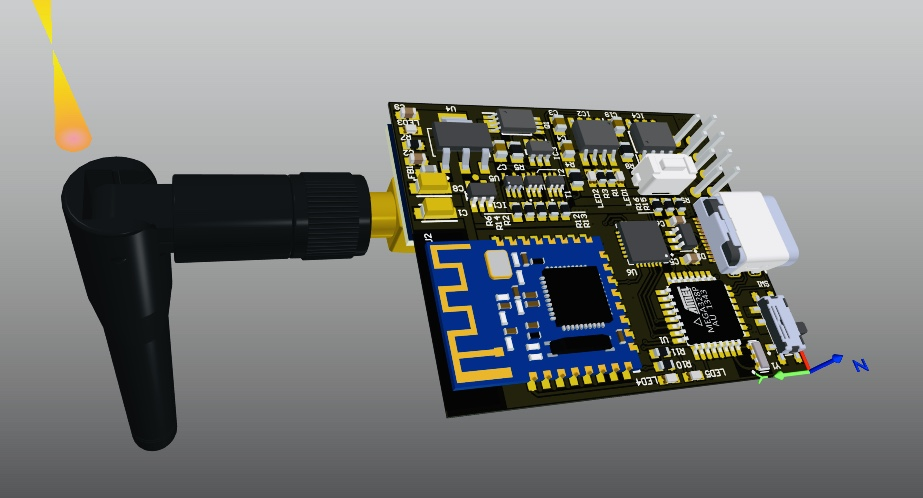
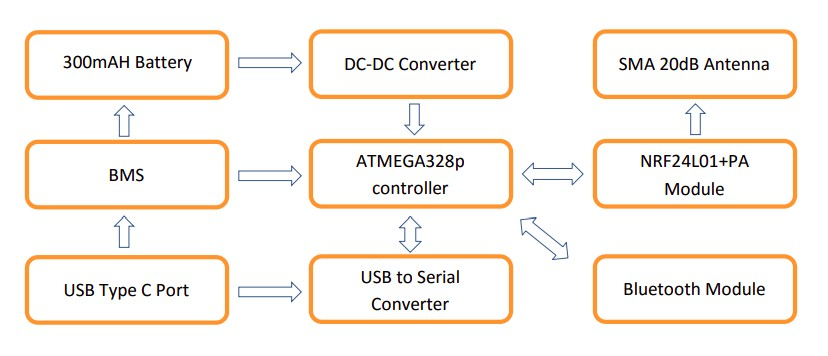

# walkie_messenger

#### Title: Wireless Short-Range Communication Device (Walkie Messenger)
#### Introduction
A regular problem that can occur in hiking groups is that the group can easily spread out as the hike progresses. Some of your party will get chatting, some will stop to take photos, some are faster over rocky terrain or rock scrambles, some are simply fitter than others and can maintain a faster pace. Inevitably, a gap between the lead and whip of your group opens up and the main role of the group leader is to make sure that the gap doesn’t get so wide as to become unmanageable to the point where one part of the group can’t locate the other. Walkie Messenger is a solution for above problem. It provides messaging, locating, tracking so you can stay connected to your group, whenever you're outside of cellular range. In case of a lifethreatening emergency device can contact search & rescue services. (SOS function). 
This device comes with mobile phone app (Android and IOS), so you can easily message to your group members, send your GPS location, can track the friend’s location. In case of Low battery in your mobile, the device automatically sends your last location to all group members. In SOS function the device sends your GPS location to group members. if you are in cellular range, device sends location to search & rescue services through SMS. If not trying to send SMS through group members mobile.

#### Product Description
##### Specifications

  - Wireless ranges
    - Wireless transmit and receive maximum range 1100m. (2.4GHz)
    - Bluetooth 5.0 with maximum range up to 100m.
    - Compatible with Bluetooth 4.2 and 4.0 devices.
  - Body
    - Dimensions 50(L) x 40(W) x 10(H) mm
    - Weight 180g
  - storage information
    - Work with mobile phone storage.
    - Device memory 32Kb (EEPROM).
  - Power
    - 2000mAH Li-Ion rechargeable nonremovable battery (3.7V).
    - Operating at 3.3V
    - Sleep mode while in standby
  - Charging
    - Recommended 1.5A USB charger for fast charging.
    
#### Functions
  - Control using mobile phone App.
  - Person to Person chat (Peer to peer communication).
  - Group chat capability (Mesh networking).
  - End to end encryption to chat.
  - Adjustable maximum transmitting range for power saving.
  - SOS button in the device to inform near persons in case of an emergency.
  - Low battery warning.
  - Firmware update over USB.
  - Automatic charging current controlling to match the power supply capability.
  - USB Type C reversible charging connector with charging current up to 1.2A.
  
#### Limitations
  - Battery life.
  - Wireless Transmitting range.
  - GPS coverage
  
#### Methodology
Walkie messenger used NRF24L01+ Single chip 2.4GHz Transceiver communicate between walkie devices (Maximum distance up to 1100m) and Bluetooth 5.0 used to connect to smart mobile phone (Maximum distance up to 100m). Some modern mobile phone has Bluetooth 4.0 or 4.2, So walkie can connect to these devices with maximum range 60m.

The amplifier IC and 20dB Antenna is used to increase the wireless communication Range. Bluetooth module has in-built PCB antenna. Atmega 328p 8bit microcontroller is used as controller.Microcontroller used UART (Universal Asynchronous Receiver/Transmitter) communication protocol to communicate with Bluetooth module and SPI (Serial peripheral interface) used to communicate between NRF24L01+ chip. 

The test message type and send to device using mobile phone application over Bluetooth. The GPS coordinates and mobile phone battery stats send to device automatically. NRF24L01+ chip has three power modes, so it can be configured using mobile app.

The CP2102n USB to Serial converter IC is used to connect device to USB interface. Firmware upgrading can do over USB (PC or MAC) and Bluetooth. Li-ion 300mAh is used to power the device, it works between the voltage level of 3.7v-4.2v and a BMS (Battery management system) is used to maintain battery health. A DC-DC converter is used to bring the voltage to 3.3V to power the Atmega 328p microcontroller and Communicating modules.

